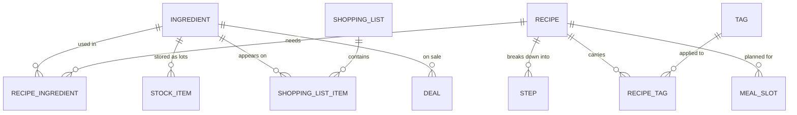

# ForkCast — Data model

> Status: Phase 1 entities implemented and migrated (see `recipes/models.py`). Phases 2-4 entities
> below remain conceptual, derived from [01-requirements.md](01-requirements.md).

## 1. Design principles

- **One household, one shared account** (see requirements §3) → no need to scope every table by
  user/tenant. Simplifies the whole model.
- **Ingredient = a reusable reference table**, not a plain text field on each recipe. That's what
  makes it possible to: aggregate the shopping list, cross-reference recipes ↔ stock (headline
  feature), and sort by store aisle (backlog idea).
- **The pantry is modeled as "lots"** (`StockItem`) rather than one running total per ingredient: a
  bag of rice bought today and another bought 2 months ago have different expiry dates. Needed for
  expiry alerts (Phase 4 requirement).
- **No dedicated table for "meal suggestion"**: it's a query/algorithm computed on the fly from
  `Recipe` + `RecipeIngredient` + `StockItem` + `Tag` (+ `Deal` for Direction B), not stored data.
  Avoids complicating the model for a feature that's fundamentally a computation.
- **The meal ↔ grocery loop is bidirectional** (see requirements §5): `StockItem` serves Direction
  A ("I have this, what do I cook"), `Deal` serves Direction B ("what do I buy and cook this
  week"). Both plug into the same `Recipe`/`Ingredient`.

## 2. Entity-relationship diagram (overview)

## 3. Entities — Phase 1: Recipes (implemented)

### `Recipe`
| Field | Type | Notes |
|---|---|---|
| id | id | |
| title | text | |
| description | text | optional |
| photo | image/url | optional |
| prep_time_min | integer | used by the "quick" filter |
| cook_time_min | integer | optional |
| default_servings | integer | basis for quantity adjustment |
| nutrition_score | enum (light/balanced/hearty) or similar | intentionally simple, no calorie calculation (see backlog idea) |
| last_cooked_on | date | nullable — feeds the suggestion's anti-repetition logic |
| created_at | datetime | |

### `Step`
| Field | Type | Notes |
|---|---|---|
| id | id | |
| recipe_id | FK → Recipe | |
| order | integer | |
| description | text | |

### `Ingredient` (reference table)
| Field | Type | Notes |
|---|---|---|
| id | id | |
| name | text | unique |
| default_unit | text | g, ml, piece... |
| aisle_category | enum | produce, pantry, frozen, dairy, meat & fish, beverages, other — used to sort the shopping list (backlog idea) |

### `RecipeIngredient` (join table)
| Field | Type | Notes |
|---|---|---|
| id | id | |
| recipe_id | FK → Recipe | |
| ingredient_id | FK → Ingredient | |
| quantity | decimal | for `default_servings` |
| unit | text | may differ from the ingredient's default unit (conversion — see §5 open questions) |

### `Tag` / recipe-tag relationship
| Field | Type | Notes |
|---|---|---|
| Tag.id, Tag.name | | e.g. "quick", "vegetarian", "gluten-free", "balanced" |
| Recipe.tags | M2M | plain Django `ManyToManyField`, no separate join model needed (no extra data on the relationship) |

## 4. Entities — Phases 2 to 4 (conceptual, not yet implemented)

### `MealSlot` (Phase 2 — Meal planning)
| Field | Type | Notes |
|---|---|---|
| id | id | |
| date | date | |
| meal_time | enum (lunch/dinner) | |
| recipe_id | FK → Recipe, nullable | empty = unplanned slot |
| planned_servings | integer | |

### `ShoppingList` / `ShoppingListItem` (Phase 3)
| Field | Type | Notes |
|---|---|---|
| ShoppingList.id, created_at | | one active list at a time, generally tied to a planning week |
| ShoppingListItem.id | id | |
| ShoppingListItem.shopping_list_id | FK → ShoppingList | |
| ShoppingListItem.ingredient_id | FK → Ingredient, nullable | nullable for "not from a recipe" additions |
| ShoppingListItem.free_text_name | text, nullable | used when there's no ingredient_id (manually added item) |
| ShoppingListItem.quantity / unit | | result of aggregating the planned recipes |
| ShoppingListItem.checked | boolean | |
| ShoppingListItem.source | enum (auto/manual) | |

### `StockItem` (Phase 4 — Pantry)
| Field | Type | Notes |
|---|---|---|
| id | id | |
| ingredient_id | FK → Ingredient | |
| quantity / unit | | |
| location | enum (pantry/fridge/freezer) | |
| expiry_date | date, nullable | feeds expiry alerts |
| added_on | date | |

### `Deal` (Direction B — manual V1 from Phase 3, automated in Phase 5)
| Field | Type | Notes |
|---|---|---|
| id | id | |
| ingredient_id | FK → Ingredient | |
| store | text, optional | e.g. "IGA", "Metro" — only useful if tracking multiple chains |
| sale_price | decimal, optional | |
| start_date / end_date | date | how long the deal is valid |
| source | enum (manual/flyer_import) | `manual` for V1; `flyer_import` reserved for future automation (Phase 5) |

## 5. Open questions / decisions for later

- **Unit conversion** (e.g. a recipe in "tablespoons", stock in "grams"): unresolved at this
  stage. For the MVP, an approximate manually-entered match is acceptable rather than a generic
  conversion engine.
- **Number of active shopping lists**: one at a time to start (simpler), to revisit if the need
  for parallel lists shows up in actual use.
- **Automatic stock deduction when a recipe is "cooked"** (mentioned in requirements §6 Phase 4):
  to decide between automatic and manual confirmation once that phase is actually tackled.
- **Nutrition score**: intentionally left as a simple enum (light/balanced/hearty) rather than a
  real macro calculation — to refine only if the need shows up in actual use.

## 6. Next steps

1. ~~Validate this model with the user.~~ Done.
2. ~~Choose the tech stack.~~ Done — see [03-tech-stack.md](03-tech-stack.md).
3. Translate the Phase 2-4 entities above into actual migrations once those phases are tackled
   (Phase 1's `Recipe`/`Step`/`Ingredient`/`RecipeIngredient`/`Tag` are already implemented).
