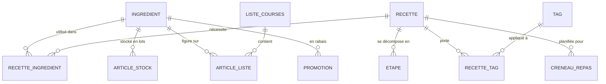

# ForkCast — Modèle de données

> Statut : brouillon de travail, dérivé de [01-cahier-des-charges.md](01-cahier-des-charges.md).
> Reste indépendant de la stack technique (pas encore choisie) — c'est un modèle conceptuel, pas
> un schéma SQL/ORM figé.

## 1. Principes de conception

- **Un seul foyer, un seul compte partagé** (cf. cahier des charges §3) → pas besoin de
  scoper chaque table par utilisateur/tenant. Simplifie tout le modèle.
- **Ingrédient = référentiel réutilisable**, pas un simple champ texte dans chaque recette. C'est
  ce qui permet : d'agréger la liste de courses, de croiser recettes ↔ stock (fonctionnalité
  phare), et de trier par rayon de magasin (idée backlog).
- **Le garde-manger est modélisé en "lots"** (`ArticleStock`) plutôt qu'un total par ingrédient :
  un paquet de riz acheté aujourd'hui et un autre acheté il y a 2 mois ont des dates de péremption
  différentes. Nécessaire pour les alertes péremption (besoin Phase 4).
- **Pas de table dédiée pour la "suggestion de repas"** : c'est une requête/algorithme calculé à la
  volée à partir de `Recette` + `RecetteIngredient` + `ArticleStock` + `Tag` (+ `Promotion` pour le
  Sens B), pas une donnée stockée. Évite de complexifier le modèle pour une fonctionnalité qui est
  avant tout du calcul.
- **La boucle repas ↔ courses est bidirectionnelle** (cf. cahier des charges §5) : `ArticleStock`
  sert le Sens A ("j'ai ça, je cuisine quoi"), `Promotion` sert le Sens B ("qu'est-ce que
  j'achète et je cuisine cette semaine"). Les deux se branchent sur les mêmes `Recette`/`Ingredient`.

## 2. Diagramme entité-relation (vue d'ensemble)

## 3. Entités — Phase 1 : Recettes

### `Recette`
| Champ | Type | Notes |
|---|---|---|
| id | id | |
| titre | texte | |
| description | texte | optionnel |
| photo | image/url | optionnel |
| temps_preparation_min | entier | utilisé par le filtre "rapide" |
| temps_cuisson_min | entier | optionnel |
| portions_defaut | entier | base pour l'ajustement des quantités |
| score_nutritionnel | enum (léger/équilibré/gourmand) ou similaire | volontairement simple, pas de calcul calorique (cf. idée backlog) |
| derniere_cuisson_le | date | nullable — alimente l'anti-répétition de la suggestion |
| date_creation | date | |

### `Etape`
| Champ | Type | Notes |
|---|---|---|
| id | id | |
| recette_id | FK → Recette | |
| ordre | entier | |
| description | texte | |

### `Ingredient` (référentiel)
| Champ | Type | Notes |
|---|---|---|
| id | id | |
| nom | texte | unique |
| unite_par_defaut | texte | g, ml, pièce... |
| categorie_rayon | enum | fruits&légumes, épicerie, surgelés, produits laitiers, viande&poisson, boissons, autre — sert au tri de la liste de courses (idée backlog) |

### `RecetteIngredient` (table de liaison)
| Champ | Type | Notes |
|---|---|---|
| id | id | |
| recette_id | FK → Recette | |
| ingredient_id | FK → Ingredient | |
| quantite | décimal | pour `portions_defaut` |
| unite | texte | peut différer de l'unité par défaut (conversion — voir §5 points ouverts) |

### `Tag` / `RecetteTag`
| Champ | Type | Notes |
|---|---|---|
| Tag.id, Tag.nom | | ex. "rapide", "végétarien", "sans gluten", "équilibré" |
| RecetteTag.recette_id, RecetteTag.tag_id | FKs | many-to-many |

## 4. Entités — Phases 2 à 4

### `CreneauRepas` (Phase 2 — Planning)
| Champ | Type | Notes |
|---|---|---|
| id | id | |
| date | date | |
| moment | enum (midi/soir) | |
| recette_id | FK → Recette, nullable | vide = créneau non planifié |
| portions_prevues | entier | |

### `ListeCourses` / `ArticleListe` (Phase 3)
| Champ | Type | Notes |
|---|---|---|
| ListeCourses.id, date_creation | | une liste active à la fois, généralement liée à une semaine de planning |
| ArticleListe.id | id | |
| ArticleListe.liste_id | FK → ListeCourses | |
| ArticleListe.ingredient_id | FK → Ingredient, nullable | nullable pour les ajouts "hors recette" |
| ArticleListe.nom_libre | texte, nullable | utilisé si pas d'ingredient_id (article ajouté à la main) |
| ArticleListe.quantite / unite | | résultat de l'agrégation des recettes du planning |
| ArticleListe.coche | booléen | |
| ArticleListe.origine | enum (auto/manuel) | |

### `ArticleStock` (Phase 4 — Garde-manger)
| Champ | Type | Notes |
|---|---|---|
| id | id | |
| ingredient_id | FK → Ingredient | |
| quantite / unite | | |
| emplacement | enum (placard/frigo/congélateur) | |
| date_peremption | date, nullable | alimente les alertes péremption |
| date_ajout | date | |

### `Promotion` (Sens B — Phase 3 en V1 manuelle, Phase 5 pour l'automatisation)
| Champ | Type | Notes |
|---|---|---|
| id | id | |
| ingredient_id | FK → Ingredient | |
| magasin | texte, optionnel | ex. "IGA", "Metro" — utile seulement si plusieurs enseignes suivies |
| prix_promo | décimal, optionnel | |
| date_debut / date_fin | date | validité du rabais |
| source | enum (manuel/import_circulaire) | `manuel` pour la V1 ; `import_circulaire` réservé à une future automatisation (Phase 5) |

## 5. Points ouverts / décisions à prendre plus tard

- **Conversion d'unités** (ex. recette en "cuillères à soupe", stock en "grammes") : non résolu à
  ce stade. Pour le MVP, on peut tolérer une correspondance approximative saisie manuellement
  plutôt qu'un moteur de conversion générique.
- **Nombre de listes de courses actives** : une seule à la fois pour commencer (plus simple), à
  revoir si le besoin de plusieurs listes en parallèle apparaît à l'usage.
- **Déduction automatique du stock quand une recette est "cuisinée"** (mentionné au cahier des
  charges §6 Phase 4) : à trancher entre automatique et confirmation manuelle une fois cette phase
  abordée concrètement.
- **Score nutritionnel** : volontairement laissé en enum simple (léger/équilibré/gourmand) plutôt
  qu'un vrai calcul de macros — à raffiner seulement si le besoin s'en fait sentir à l'usage.

## 6. Prochaines étapes

1. Valider ce modèle (ou l'ajuster) avec l'utilisateur.
2. Discuter et choisir la stack technique — le modèle ci-dessus est conçu pour rester neutre
   vis-à-vis de ce choix (relationnel classique, s'adapte à peu près à n'importe quel framework).
3. Traduire ce modèle en schéma concret (migrations / ORM) une fois la stack choisie.
